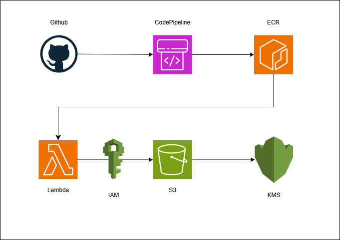

# README

A fully containerized AWS Lambda function using Python 3.11, Faker, Boto3, and S3 — built and deployed through a CodePipeline → CodeBuild → ECR → Lambda workflow. All sensitive data is stored in a secure KMS-encrypted S3 bucket.

## Features
- AWS Lambda container image (Python 3.11)
- Faker-generated user and company data
- Secure data writes to S3 (KMS-encrypted)
- CI/CD pipeline with CodePipeline
- Image artifacts stored in ECR
- Manual build in CodePipeline
- Infrastructure defined in CloudFormation
- IAM roles defined in JSON

# Architecture




# Repo Structure
```
lambda-faker-api/
├── app/
│   └── lambda_function.py
├── Dockerfile
├── requirements.txt
├── buildspec.yml
├── ECR_Lifecycle_Policy.json
├── Lambda_Role.json
├── secure-s3.yaml
└── README.md
```

## Getting Started

This project uses AWS Lambda containers, CodePipeline, and S3 with KMS encryption.

### Prerequisites

- AWS Account with permissions for Lambda, ECR, S3, KMS, IAM, and CodePipeline
- GitHub repo with this code
- A working GitHub → CodePipeline connection

### Setup Overview

1. Create an ECR repo to store the container image
2. Push this code to GitHub
3. Use AWS CodePipeline (Push to ECR template) to:
   - Pull from GitHub
   - Build Docker image
   - Push image to ECR
4. Manually deploy the ECR image to Lambda
5. Test your Lambda function

## Manual Deployment

This pipeline is triggered **manually** (not on every commit), giving you full control.

To deploy:

1. Push your changes to `main`
2. Go to **CodePipeline** in AWS Console
3. Select your pipeline (e.g., `lambda-faker-api-pipeline`)
4. Click **Release change**
5. Wait for it to complete — check ECR for new image

Then go to **Lambda > Your function > Edit image URI** and select the new image.

## Security Notes

- All objects stored in S3 are encrypted using a customer-managed AWS KMS key
- The Lambda role is granted least-privilege access to:
  - Write to the secure S3 bucket
  - Use the KMS key for encryption and decryption
- Public access to the S3 bucket is fully blocked
- Versioning is enabled to track changes to uploaded files

